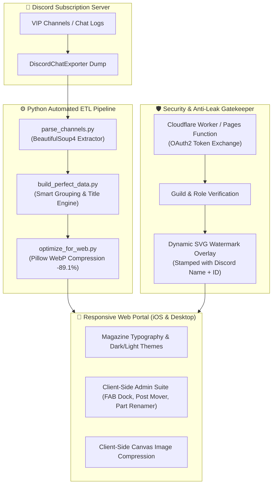

# 💎 Exclusive Community Archive & Anti-Piracy Reading Portal
> **Cổng Lưu Trữ & Đọc Bài Viết Độc Quyền Chống Sao Chép Dành Cho Cộng Đồng Trả Phí**

<p align="center">
  <a href="#-english"><b>English</b></a> •
  <a href="#-tiếng-việt"><b>Tiếng Việt</b></a>
</p>

[](https://pages.cloudflare.com)
[](https://discord.com)
[](https://python.org)
[](https://github.com)

---

## 🌐 English

A high-performance, responsive private publication portal and automated content ingestion pipeline built for paid Discord subscription communities (VIP Inner Circle). Designed to deliver a distraction-free, magazine-grade reading experience while safeguarding exclusive intellectual property against unauthorized distribution.

### 🌟 System Architecture & Engineering Flow



### 🎯 Key Engineering Highlights

#### 1. 🛡️ Anti-Piracy DRM & Dynamic Watermark Engine
* **Dynamic Discord Identity Stamping:** Readers authenticate via Discord OAuth2. The web application dynamically overlays an unobtrusive, repeat-pattern SVG watermark across all articles featuring the logged-in user's exact **Discord Display Name and Snowflake ID**.
* **Deterrent Effect:** Any attempt to take a screenshot or record video to leak content exposes the leaker's identity directly on the image, deterring unauthorized reposting.
* **Content Hardening:** Right-click context menus, text selection, image drag-and-drop, developer console shortcut triggers, and print-to-PDF (`@media print`) are disabled.

#### 2. ⚡ High-Throughput Python ETL Pipeline
* **Chat-to-Article Aggregator (`build_perfect_data.py`):** Automatically groups consecutive message fragments into clean articles, cleans redundant boilerplate headers (e.g. `>>>>>bài viết X<<<<<`), and extracts legitimate headings.
* **Smart Media Optimizer (`optimize_for_web.py`):** Converts raw PNG/JPG uploads to optimized `.webp` images at 82% quality, shrinking overall asset footprint by **89.1%** (reducing hundreds of megabytes down to ~46 MB) without visible quality loss.

#### 3. 📱 Mobile-First Responsive Design (iOS Safari Dynamic Viewport)
* **iOS Safari Toolbar Safe-Area Adaptation:** Leverages CSS `100dvh` (Dynamic Viewport Height) combined with `env(safe-area-inset-bottom)` and negative scroll bumpers, solving mobile Safari's bottom bar occlusion bug.
* **Floating Action Button (FAB) Admin Dock:** In Admin mode, provides a floating, thumb-accessible control dock on mobile portrait mode for 1-tap post addition, topic renaming, and data export without device rotation.

#### 4. ✏️ In-Browser Admin Management Suite
* **Zero-Database Lightweight Persistence:** Allows the community owner to edit post contents, upload images from camera/gallery (compressed client-side via HTML5 Canvas), rename topic categories, and migrate posts across sections dynamically with instant `localStorage` caching and one-click `data.js` bundle export.

---

## 🇻🇳 Tiếng Việt

Hệ thống lưu trữ và đọc bài viết độc quyền hiệu năng cao, tích hợp đường ống tự động hóa xử lý dữ liệu và cơ chế bảo vệ bản quyền số (DRM) dành riêng cho các cộng đồng trả phí trên Discord (VIP Inner Circle). Dự án mang lại trải nghiệm đọc bài chuẩn tạp chí cao cấp, đồng thời ngăn chặn triệt để hành vi sao chép, chụp màn hình phát tán ra bên ngoài.

### 🎯 Các Điểm Sáng Kỹ Thuật Nổi Bật

#### 1. 🛡️ Cơ Chế Đóng Dấu Bản Quyền Động (Dynamic Watermark Anti-Piracy)
* **In chìm danh tính Discord theo thời gian thực:** Người đọc đăng nhập thông qua Discord OAuth2. Hệ thống tự động tạo lớp phủ SVG in chìm mang đúng **Tên hiển thị & Discord ID** của người đang đọc phủ khắp trang bài viết.
* **Ngăn chặn leak bài:** Nếu bất kỳ ai chụp màn hình hay quay video phát tán ra ngoài, danh tính và ID Discord sẽ hiện rõ mồn một trên ảnh chụp $\rightarrow$ Không ai dám leak bài trái phép.
* **Bảo vệ toàn diện:** Khóa chuột phải, cấm quét chọn bôi đen (copy), chặn kéo thả lưu ảnh, vô hiệu hóa phím tắt DevTools (F12, Ctrl+U) và tự động xóa trắng nếu cố tình in ra PDF (`@media print`).

#### 2. ⚡ Đường Ống Xử Lý Dữ Liệu Tự Động Bằng Python (ETL Pipeline)
* **Bóc tách & Chuẩn hóa (`build_perfect_data.py`):** Tự động gom các tin nhắn lẻ tẻ trên Discord thành các bài viết hoàn chỉnh, tự nhận diện tiêu đề và làm sạch các dòng thông báo lặp lại.
* **Nén ảnh WebP thông minh (`optimize_for_web.py`):** Tự động chuyển đổi hàng trăm ảnh gốc sang chuẩn WebP, **giảm tới 89.1% dung lượng** (từ 427 MB xuống còn ~46 MB) giúp website tải siêu nhanh trên mạng di động.

#### 3. 📱 Tối Ưu Trải Nghiệm Di Động & Safari iOS
* **Tương thích thanh điều hướng Safari:** Áp dụng `100dvh` kết hợp vùng an toàn `env(safe-area-inset-bottom)`, khắc phục hoàn toàn lỗi kẹt cuộn trang bị che khuất bởi thanh công cụ dưới đáy của iPhone Safari.
* **Thanh điều khiển nổi (FAB Dock) cho Admin:** Cho phép chủ kênh thêm bài mới, đổi tên chủ đề và tải file dữ liệu ngay trên màn hình điện thoại dọc chỉ với 1 chạm ngón tay cái mà không cần xoay ngang máy.

#### 4. ✏️ Chế Độ Quản Trị Trực Tiếp Trên Trình Duyệt
* Tự chỉnh sửa câu từ, tải ảnh từ thư viện/camera (tự nén qua HTML5 Canvas), đổi tên các phần theo chủ đề, di chuyển bài viết giữa các phần linh hoạt và xuất file dữ liệu `data.js` cập nhật vĩnh viễn mà không cần cài đặt cơ sở dữ liệu cồng kềnh.

---

## 📂 Project Structure / Cấu Trúc Thư Mục

```
.
├── index.html                   # Core web application (Single Page Architecture)
├── data.js                      # Structured article database (Sample Mock Data)
├── .gitignore                   # Ignore sensitive files, credentials, and raw chat logs
├── serverless/
│   └── cloudflare-worker-auth.js# Cloudflare Worker for Discord OAuth2 validation
├── pipeline/
│   ├── requirements.txt         # Dependencies (BeautifulSoup4, Pillow)
│   ├── parse_channels.py        # Extracts raw messages from HTML chat exports
│   ├── build_perfect_data.py    # Cleans typography, headers, and groups posts
│   └── optimize_for_web.py      # Resizes and compresses media to WebP format
└── README.md                    # Bilingual documentation & architecture overview
```

---

## 🚀 Quickstart & Local Development / Hướng Dẫn Chạy Thử

### 1. Run the Web Application
No build tools or NodeJS runtime required for the frontend. Simply serve the repository root with Python:

```bash
python -m http.server 8080
```
Open `http://localhost:8080` in your browser.

* **Demo Member Passcode:** `DEMO2026`
* **Demo Admin Passcode:** `ADMIN_DEMO_2026`

### 2. Running the Data Pipeline
```bash
cd pipeline
pip install -r requirements.txt

# Step 1: Parse channel HTML exports
python parse_channels.py

# Step 2: Build structured data.js
python build_perfect_data.py

# Step 3: Compress media assets to WebP
python optimize_for_web.py
```

---

## 🔒 Security Best Practices / Tiêu Chuẩn Bảo Mật

* **No Hardcoded Credentials:** Real Discord OAuth client secrets and production database keys are managed strictly via Cloudflare Environment Secrets.
* **Source Protection:** Private copyrighted writings and personal member identities are strictly excluded from version control via `.gitignore`.

---

## 📄 License
This project is licensed under the [MIT License](LICENSE) - see the LICENSE file for details. Built with passion for creator communities.
